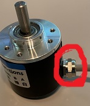
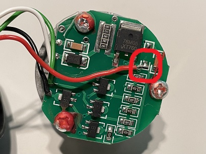
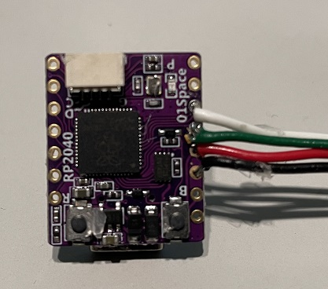
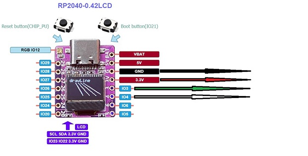
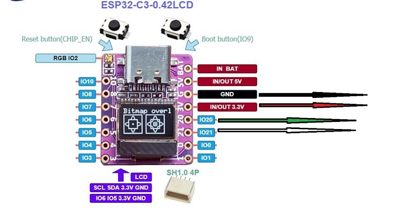
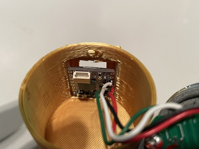
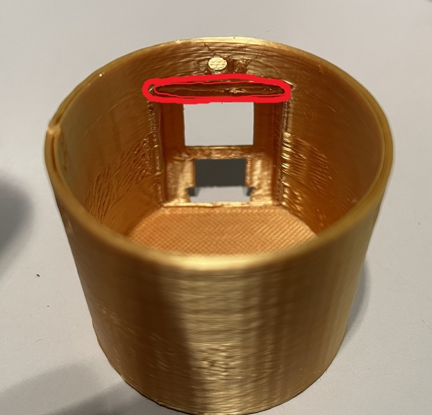
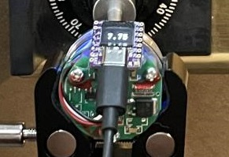

# Mini Digital Dial Magnifier

**Description:**

The Digital Dial Magnifier (DDM) is an aid for manual safe lock manipulation as performed by locksmiths, safe technicians and locksport enthusiasts.  

The Mini DDM divides one turn of the dial into 4000 steps.  On a standard 100 number safe dial, this divides each dial number into 40 steps, for a resolution of 0.025.  This high resolution helps the user to identify very small changes in contact point locations.  

The Mini DDM  is mounted to the safe door using an adjustable magnetic base.  It is connected to the safe dial using flexible couplers, one of which is connected directly to the dial with either hot-glue or double sided tape.  The use of two flexible couplers allows for a slightly off center and/or misaligned connection without binding.

The Mini Digital Dial Magnifier is an open source project released without any warranty or support of any kind.  If you require technical support, the more capable **_Dial Reader_** and **_Dial Reader Pro_** can be purchased fully assembled and supported by contacting [sales@charlesbuildscrap.com](mailto:sales@charlesbuildscrap.com).  

### **Build Instructions:**

**Prerequisites:**

In order to build the Mini Digital Dial Magnifier: 

* You must be familiar with the Arduino IDE and how to upload code to compatible boards. 
* You will need to know basic soldering.

Optional, but suggested:

* 3D printing experience

**Tools and supplies:**

Required:

* Small phillips screwdriver
* Side cutters
* Soldering iron & Solder 
* Usb C cable
* Hot Glue gun & glue

Optional, but suggested:

* 3D printer & filament
* Needle nose pliers
* Soldering station with part holding clamps

**Components:**

* Micro Controller: [https://www.aliexpress.us/item/3256804155174358.html](https://www.aliexpress.us/item/3256804155174358.html)
* Encoder: [https://www.aliexpress.us/item/3256803057031062.html](https://www.aliexpress.us/item/3256803057031062.html)
* Couplings: [https://www.aliexpress.us/item/3256804177623925.html](https://www.aliexpress.us/item/3256804177623925.html)
* Shaft: [https://www.aliexpress.us/item/3256802574723472.html](https://www.aliexpress.us/item/3256802574723472.html)
* Magnetic Mount: [https://www.amazon.com/Fixture-Magnetic-Bracket-Soldering-Flashlight/dp/B09B4RPVK3/](https://www.amazon.com/Fixture-Magnetic-Bracket-Soldering-Flashlight/dp/B09B4RPVK3/)

**Alternates and Options:**

* Coupling: [https://www.aliexpress.us/item/2255800561943356.html](https://www.aliexpress.us/item/2255800561943356.html)
* Magnetic Mount: [https://www.aliexpress.us/item/3256802833873388.html](https://www.aliexpress.us/item/3256802833873388.html)
* Power Supply: [https://www.amazon.com/CanaKit-Raspberry-Power-Supply-USB-C/dp/B07TYQRXTK/](https://www.amazon.com/CanaKit-Raspberry-Power-Supply-USB-C/dp/B07TYQRXTK/)
* Aluminum Rod: [https://www.amazon.com/gp/product/B09NM92G1Y/](https://www.amazon.com/gp/product/B09NM92G1Y/)

**Print case & centering jig:**

1. Download the .stl files from github and print on your 3D printer [https://github.com/currentc57/mini-digital-dial-magnifier](https://github.com/currentc57/mini-digital-dial-magnifier) 

**Program the MCU:**

1. Install the appropriate arduino core for your controller board.
    1. If you are using the RP2040 based board you will need to install the Earle F. Philhower arduino-pico core [https://github.com/earlephilhower/arduino-pico](https://github.com/earlephilhower/arduino-pico) - When uploading, you will need to select the "Seeed XIAO RP2040" board.
    2. If you are using the ESP32C3 based board you will need to install the Arduino core for the Espressif ESP32 [https://github.com/espressif/arduino-esp32/](https://github.com/espressif/arduino-esp32/) - When uploading, you will need to select the "ESP32C3 Dev Module" board.
2. Install the Universal 8 bit Graphics Library by olikraus [https://github.com/olikraus/u8g2/](https://github.com/olikraus/u8g2/) 
3. Download source code from github [https://github.com/currentc57/mini-digital-dial-magnifier](https://github.com/currentc57/mini-digital-dial-magnifier) 
4. Upload to the controller board.

**Modify the encoder:**

1. If present, loosen the cord grip.

2. Remove the screws and then the case.
3. De-solder the red wire. 

4. Solder the red wire to the new location.

5. Cut wires to approximately 2 to 3 inches in length.

**Solder MCU & encoder:**

1. Solder the wires to the back of the controller board as pictured.

2. Double check all wire connections and solder joints.
3. Plug in power and test.

**Assembly:**

If using the housing: 

1. Position the controller in the housing, usb connector first

2. Then carefully push the top of the board in place.
    1. If it doesn’t snap in with moderate pressure, carefully trim the upper catch. **CAUTION**: pressing too hard may damage board.

3. Hot gluing the board in place is suggested.
4. Slide encoder into case and secure with screws

Otherwise:

1. Hot glue the controller to the encoder frame and circuit board.

### **Operating Instructions:**

**Attach couplers and shaft to dial:**

1. Covering the center of the safe dial with blue painters tape will help protect dial from damage. 
2. Locate the center of the dial.
3. Attach the coupler to the center of the dial using double sided tape or hot glue.
4. Insert the 6mm shaft into the coupler 5mm - 6mm (far enough for the set screws to hold it) and tighten the set screws.
5. Attach the second coupler to the other end of the shaft in the same manner.

**Mount the DDM:**

1. Place the magnetic end of the base on the safe (directly below dial is best) and gently secure the DDM in the clamp.  **CAUTION**: 3D printed housing can be crushed if the clamp is overtightened. 
2. Loosen the adjustment thumb screw on the base and position the DDM so that the encoder shaft is aligned with the couplers.  
3. Insert the encoder 5mm-6mm into the second coupler and tighten the thumb screw to lock the base. 
4. Tighten the coupler’s set screws onto the encoder shaft.
5. Rotate the dial through a few rotations to settle the mounting.
6. Ensure there is no drag or binding when feeling for the contact points.  
7. If you feel any added resistance near the contact points double check you're centered and the shaft is aligned properly.

**Set zero:**

1. Turn the dial to zero 
2. Plug in the USB C cable to power on the DDM.
3. Wait for the DDM to boot and you’re ready to go.
